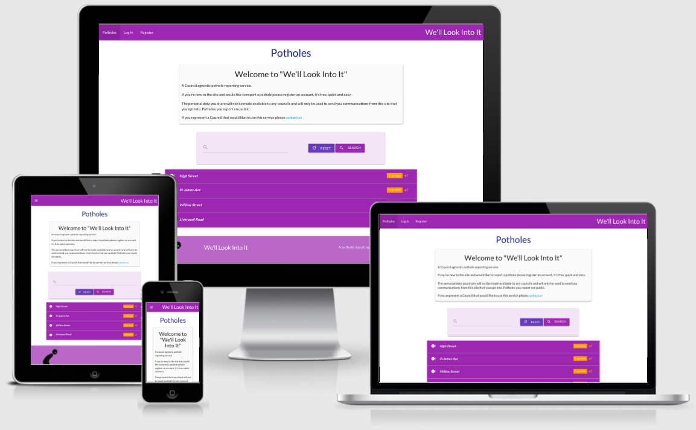
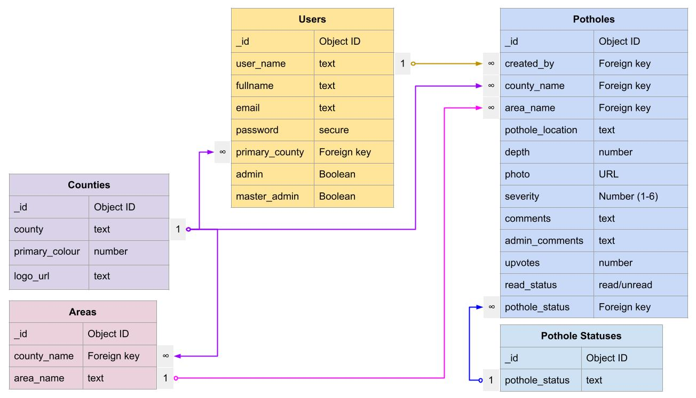

# We'll Look Into It

## Code Institute Milestone 3 Project

[The Live Website](https://ci-ms3-we-ll-look-into-it.herokuapp.com/)

## Table of Contents

---

1. [Project Goals](#project-goals)
   1. [Public Users](#public-users)
   2. [Council Users](#council-users)
2. [User Experience](#user-experience)
   1. [Target Audience](#target-audience)
   2. [User Stories](#user-stories)
      1. [First Time Visitors](#first-time-visitors)
      2. [Returning Visitors](#returning-visitors)
      3. [Council Employees](#council-employees)
3. [Scope](#scope)
   1. [Design](#design)
       1. [Colour Scheme](#colour-scheme)
       2. [Typography](#typeography)
       3. [Images](#images)
4. [Wireframes](#wireframes)
5. [Features](#features)
6. [Technologies Used](#technologies-used)
7. [Testing](#testing)
   - [Bugs During Development](#Bugs-found-and-resolved-during-development)
8. [Deployment](#deployment)
9. [Credits](#credits)
10. [Acknowledgements](#acknowledgements)

## Project Goals

### Public Users

* To have a quick and easy way to report pot holes.
* To provide comments comments when reporting a pothole.
* To see what potholes they've reported and their status.
* To delete or update the details of potholes they've reported.
* To see all potholes reported and their status.
* To be able to request re-assesment of potholes marked as no repair requied if they've gotten worse.

### Council Users

* To view a list of publicly reported potholes for assessment.
* To update the status of potholes as they progress through internal systems.
* To be able to mark potholes as resolved or not.
* To be able to grant registered users admin rights to manage potholes.
* To NOT have the ability to delete potholes, only update status.
* To see a list of newly added/unread pothole reports.
* To be able to add comments to pothole reports.

[Back to Index](#table-of-contents)

## User Experience

The site is to be designed with simplicity and ease of access in mind.  It will have a mobile first approach to make reporting potholes quick and easy.  Users will be required to register for an account to report and manage their pothole submissions.  Users will be given the opportunity to comment on their submissions to provide helpful information as to why the pothole should be dealt with.  Search capability will be provided so users, registered or not, can check if a pothole has been reported already to save duplicate reports.

### Target Audience

* Public road users
* Council employees responsible for road maintenance

### User Stories

#### First Time Visitors

As a first time visitor I want...

1. to be able to search pothole reports to see if a report has already been made.
2. to easily register for the site and submit a pothole report.

#### Returning Visitors

Upon returning to the site I want to...

3. view a list of my reports and check their status.
4. update my reports to add or remove information.
5. upvote other users reports.
6. request a previously unrepaired pothole be reviewed following a change to it's condition.

#### Council Employees

As someone administering potholes for a coucil I want to...

7. view a list of all pothole reports for my county.
8. see any newly submitted pothole reports.
9. update the status of existing reports and add comments.
10. grant access to my colleagues to be able to update reports.
11. add or update Areas for my county.
12. add or update Pothole Status'.

#### Site Owners/Administrators

As the site owner I want to...

13. have access to admin level controls.
14. add new Councils to the system.
15. set users as Admin or Master Admin.

[Back to Index](#table-of-contents)

## Scope

Based on the project goals the site will use the templating language flask so content can be built dynamically based on a backend database.  For this project MongoDB will be used for the data because of the simple data structure.

The following features will be included based on the goals and user stories.

1. Limited user management with the ability to register for a new account.
2. Create new pothole reports.
3. Search existing pothole reports.
4. Edit your own pothole reports.
5. Delete your own reports.
6. See the status of reports.

Admin features:

7. Add and remove Areas from counties.
8. Grant other users admin privileges.

Master Admin account features:

9. Add, Edit and Delete counties.
10. Add, Edit and Delete Pothole status'.
11. Revoke user admin privileges.

## Design

Used Materialize

### Database

The author designed the database schema to allow fo flexibility of use to be adaptable to a wide range of councils.

### Colour Scheme

### Typography

### Images

The only image used on the site is the logo that I created.

### Wireframes

**Desktop**

[Potholes](docs/wireframes/d_01_home_page.jpg)

[Register](docs/wireframes/d_02_register_page.jpg)

[Login](docs/wireframes/d_03_log_in_page.jpg)

[Add Report](docs/wireframes/d_04_add_report_page.jpg)

[Manage Users](docs/wireframes/d_05_manage_users_page.jpg)

[Manage Counties, Areas or Status'](docs/wireframes/d_06_manage_county_area_status_pages.jpg)

[Add Counties, Areas or Status'](docs/wireframes/d_07_add_county_area_status_pages.jpg)

**Tablet**

[Potholes](docs/wireframes/t_01_home_page.jpg)

[Register](docs/wireframes/t_02_register_page.jpg)

[Login](docs/wireframes/t_03_log_in_page.jpg)

[Add Report](docs/wireframes/t_04_add_report_page.jpg)

[Manage Users](docs/wireframes/t_05_manage_users_page.jpg)

[Manage Counties, Areas or Status'](docs/wireframes/t_06_manage_county_area_status_pages.jpg)

[Add Counties, Areas or Status'](docs/wireframes/t_07_add_county_area_status_pages.jpg)

**Mobile**

[Potholes](docs/wireframes/m_01_home_page.jpg)

[Register](docs/wireframes/m_02_register_page.jpg)

[Login](docs/wireframes/m_03_log_in_page.jpg)

[Add Report](docs/wireframes/m_04_add_report_page.jpg)

[Manage Users](docs/wireframes/m_05_manage_users_page.jpg)

[Manage Counties, Areas or Status'](docs/wireframes/m_06_manage_county_area_status_pages.jpg)

[Add Counties, Areas or Status'](docs/wireframes/m_07_add_county_area_status_pages.jpg)

### Features

### Technologies Used

### Testing

Testing has been documented in the separate [TESTING.md](docs/TESTING.md) file

### Deployment

### Credits

#### Acknowledgements