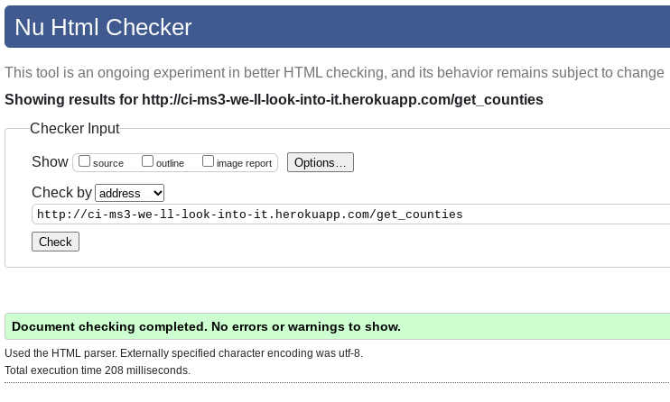

# We'll Look Into It - Testing

[Return](README.md) to We'll Look Into It README file.

## Table of Contents

- [HTML Validation](#HTML-Validation)
- [CSS Validation](#CSS-Validation)
- [Accessibility](#Accessibility)
- [Performance](#Performance)
- [JSHint testing](#JSHint-testing)
- [Tests on Various Devices](#Tests-on-Various-Devices)
    - [Devices Tested](#Devices-Tested)
    - [Tests Performed](#Tests-Performed)
- [Testing User Stories](#testing-user-stories)
- [Browser Compatibility](#Browser-Compatibility)
- [Bugs found and resolved during development](#bugs-found-and-resolved-during-development)

---

### HTML Validation

The author used the [W3C Markup Validation Service](https://validator.w3.org/) to validate the HTML of as many of the pages on the site as possible.  Some defensive programming to prevent access to pages without being logged in made accessing them from the checker impossible.  Those pages that hadn't been locked down were manually navigated to and tested. Most pages showed no errors.

#### Login

**Login page result**

#### Potholes

**Potholes list page (get_potholes)**

**Pothole add page (add_pothole)**

**Pothole edit page (edit_pothole)**

This page initally returned errors.

1. The 'selected' attribute had been left on the default select list option meaning when the selected option fomr the database was populated 2 options were marked as selected.
2. The 'required' attribute was included on the `input type='range'` element.  This was likely due to a copy/paste.  The author wasn't aware of this limitation until receiving this error

Both these errors were corrected and a new test passed:

#### Counties

**Counties list page (get_counties)**

**Counties edit page (edit_counties)**

**Counties add page (add_counties)**

This is an example of the effect of the defensive programming at work.  Due to the page not being accessible without being logged in as a result of no session cookie present the validator was not able to access the page.

#### Status'
Where possible I have used the term status' to refer to multiple status items.  Where this isn't possible for programming purposes I have used statuses.  

**Status' List page (ph_status)**

Status add page(add_status)**

**Status edit page (edit_status)**

---

### CSS Validation

The author used the [W3C CSS Validation Service](http://jigsaw.w3.org/css-validator/validator) to validate the style.css file of the site.  It returned no errors.

---

### Accessibility

The author used the [WAVE WebAIM web accessibility evaluation tool](https://wave.webaim.org/report#/http://ci-ms3-we-ll-look-into-it.herokuapp.com/) to check if there were any issues with accessibility standards.  

The reports show some contrast errors with form labels.  These are the result of the Materialize CSS framework's predefined custom styling for input items.  This is something that I found very difficult to customise or override with my own CSS that sometimes produced inconsistent results.  As a result I have chosen to leave the form labels as they are with a view to customising in the future.

**Register page**

The register page has 6 input fields on it resulting in the 6 contrast errors.

**Login page**

**Potholes list page**

**Counties list page**

---

### Performance

---

### JSHint testing

The author used [JSHint](https://jshint.com/) to verify the javascript used in the site.  

In both results the undefined variable M is identified.  This is the Materialze framework's own method and is defined in an external file.

Also, both results show their respective function names as being unused variables.  These functions are called externally from HTML pages and are therefore unused within their respective scripts.

**script.js**

**flash_messages.js**

### PEP8 Testing

The author used [PEP8 Online](http://pep8online.com/) to check the python code for any errors.  None were reported.

**PEP8 result**

### Tests on Various Devices
#### Devices Tested
#### Tests Performed
### Testing User Stories

As a first time visitor I want...

1. to be able to search pothole reports to see if a report has already been made.

2. to easily register for the site and submit a pothole report.
    - View this being tested in this [video](assets/videos/testing_potholes_add.webm)

---

Upon returning to the site I want to...

3. view a list of my reports and check their status.
4. update my reports to add or remove information.
5. upvote other users reports.
6. request a previously unrepaired pothole be reviewed following a change to it's condition.

---

As someone administering potholes for a coucil I want to...

7. view a list of all pothole reports for my county.
8. see any newly submitted pothole reports.
9. update the status of existing reports and add comments.
10. grant access to my colleagues to be able to update reports.
11. add or update Areas for my county.
12. add or update Pothole Status'.
    - View this being tested in this [video](https://user-images.githubusercontent.com/78867133/146281282-7fe12068-12bb-45e7-8d93-4c4561f30dd4.mp4)

---

As the site owner I want to...

13. have access to admin level controls.
14. add new Councils to the system.
15. set users as Admin or Master Admin.

**NOTE:** Although the background image is not present in most of these vidoes it's addition had no material impact on the functionality of the site.  Performance testing was completed with the background image in place.

---

### Browser Compatibility
## Bugs found and resolved during development

