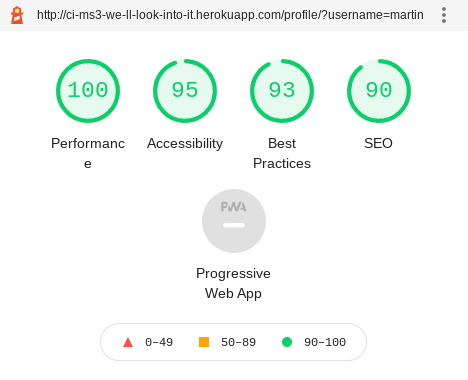

# We'll Look Into It - Testing

[Return](README.md) to We'll Look Into It README file.

## Table of Contents

- [HTML Validation](#HTML-Validation)
- [CSS Validation](#CSS-Validation)
- [Accessibility](#Accessibility)
- [Performance](#Performance)
- [JSHint testing](#JSHint-testing)
- [Tests on Various Devices](#Tests-on-Various-Devices)
    - [Devices Tested](#Devices-Tested)
    - [Tests Performed](#Tests-Performed)
- [Testing User Stories](#testing-user-stories)
- [Browser Compatibility](#Browser-Compatibility)
- [Bugs found and resolved during development](#bugs-found-and-resolved-during-development)

---

### HTML Validation

The author used the [W3C Markup Validation Service](https://validator.w3.org/) to validate the HTML of as many of the pages on the site as possible.  Some defensive programming to prevent access to pages without being logged in made accessing them from the checker impossible.  Those pages that hadn't been locked down were manually navigated to and tested. Most pages showed no errors.

#### Login

**Login page result**

#### Potholes

**Potholes list page (get_potholes)**

**Pothole add page (add_pothole)**

**Pothole edit page (edit_pothole)**

This page initally returned errors.

1. The 'selected' attribute had been left on the default select list option meaning when the selected option fomr the database was populated 2 options were marked as selected.
2. The 'required' attribute was included on the `input type='range'` element.  This was likely due to a copy/paste.  The author wasn't aware of this limitation until receiving this error

Both these errors were corrected and a new test passed:

#### Counties

**Counties list page (get_counties)**

**Counties edit page (edit_counties)**

**Counties add page (add_counties)**

This is an example of the effect of the defensive programming at work.  Due to the page not being accessible without being logged in as a result of no session cookie present the validator was not able to access the page.

#### Status'
Where possible I have used the term status' to refer to multiple status items.  Where this isn't possible for programming purposes I have used statuses.  

**Status' List page (ph_status)**

Status add page(add_status)**

**Status edit page (edit_status)**

---

### CSS Validation

The author used the [W3C CSS Validation Service](http://jigsaw.w3.org/css-validator/validator) to validate the style.css file of the site.  It returned no errors.

---

### Accessibility

The author used the [WAVE WebAIM web accessibility evaluation tool](https://wave.webaim.org/report#/http://ci-ms3-we-ll-look-into-it.herokuapp.com/) to check if there were any issues with accessibility standards.  

The reports show some contrast errors with form labels.  These are the result of the Materialize CSS framework's predefined custom styling for input items.  This is something that I found very difficult to customise or override with my own CSS that sometimes produced inconsistent results.  As a result I have chosen to leave the form labels as they are with a view to customising in the future.

**Register page**

The register page has 6 input fields on it resulting in the 6 contrast errors.

**Login page**

**Potholes list page**

**Counties list page**

---

### Performance

[Google Lighthouse](https://developers.google.com/web/tools/lighthouse/) has been used to test the performance of the main pages of the site.  For Counties, Areas and Status' the add & edit pages were not tested because these are based on the add & edit pothole pages as a starting point.

**Register**

The register page has a relatively low score on Accessibility compared to other pages.  The main difference is the use of the Materialize select input, the `label` is not associated to the `select` element using the `for` attribute which affects the score.  For a future version I will replace this with a standard `select` input with my own custom styling as used on the add and edit pothole pages.

**Login**

**Get Potholes**

**Add Potholes**

**Edit Potholes**

**Get Counties**

**Get Areas**

**Get Status'**

**Profile**

**Users**

---

### JSHint testing

The author used [JSHint](https://jshint.com/) to verify the javascript used in the site.  

In both results the undefined variable M is identified.  This is the Materialze framework's own method and is defined in an external file.

Also, both results show their respective function names as being unused variables.  These functions are called externally from HTML pages and are therefore unused within their respective scripts.

**script.js**

**flash_messages.js**

### PEP8 Testing

The author used [PEP8 Online](http://pep8online.com/) to check the python code for any errors.  None were reported.

**PEP8 result**

### Tests on Various Devices

#### Devices Tested

- Xiaomi Redme Note 9
- Lenovo Thinkpad C13 Yoga (Chrome & Firefox)
- 

#### Tests Performed

1. All links in page naviagation work and aren't broken.
2. Register page works correctly and logs user in after registration.
3. Login page works.
4. Profile correctly display's users own pothole reports.
5. Potholes page shows all potholes.
6. Search function works.
7. Upvote function works.
8. Add pothole page works and pothole gets added to the database.
9. Edit pothole pages works and changes made are saved to the database.
10. Admin users can make other users Admins.
11. Master Admins users can make other users Master Admins.
12. Admins can view, edit, add & delete Areas and pothole status'.
13. Master Admins can view, edit, add & delete Counties.

### Testing User Stories

As a first time visitor I want...

1. to be able to search pothole reports to see if a report has already been made.
    - Video

2. to easily register for the site and submit a pothole report.
    - View this being tested in this video

https://user-images.githubusercontent.com/78867133/146469476-6b135880-9f29-4e79-8556-acae19fca975.mp4

https://user-images.githubusercontent.com/78867133/146469623-72f9a354-5f53-4d68-ae65-6ae9df0db94d.mp4

---

Upon returning to the site I want to...

3. view a list of my reports and check their status.
    - video
4. update my reports to add or remove information.
    - video
5. upvote other users reports.
    - video
6. request a previously unrepaired pothole be reviewed following a change to it's condition.
    - video

---

As someone administering potholes for a coucil I want to...

7. view a list of all pothole reports for my county.
    - Future release?
8. see any newly submitted pothole reports.
    - Future release?
9. update the status of existing reports and add comments.
    - https://user-images.githubusercontent.com/78867133/146469770-cadb5981-2d43-4d87-820c-f76a15a95c2c.mp4

10. grant access to my colleagues to be able to update reports.
    - video

https://user-images.githubusercontent.com/78867133/146469824-419ff91e-4dfc-4125-a417-f1263ffaac5b.mp4

11. add or update Areas for my county.
    -video

https://user-images.githubusercontent.com/78867133/146469851-0e2ccb06-7a97-4f9d-8814-9f09aeba65c9.mp4

https://user-images.githubusercontent.com/78867133/146469866-152cb54c-6444-440d-abea-f1d52a5c54f2.mp4

https://user-images.githubusercontent.com/78867133/146469877-42c39daa-c359-4c63-b380-bee79d36cb08.mp4

12. add or update Pothole Status'.
    - View this being tested in this [video](https://user-images.githubusercontent.com/78867133/146281282-7fe12068-12bb-45e7-8d93-4c4561f30dd4.mp4)

---

As the site owner I want to...

13. have access to admin level controls.
    - video
14. add new Councils to the system.
    - video

https://user-images.githubusercontent.com/78867133/146469944-942a7760-0c4a-4e4d-8eab-925630c2ed41.mp4

https://user-images.githubusercontent.com/78867133/146469965-aee3f82e-199f-4d4c-b3aa-5f7515b1226f.mp4

https://user-images.githubusercontent.com/78867133/146469977-0bfaf991-5546-4d51-b3a7-41a8caba79d6.mp4

15. set users as Admin or Master Admin.
    - video

https://user-images.githubusercontent.com/78867133/146469995-aed8443a-2ae4-4b65-9b23-3123765e5984.mp4

**NOTE:** Although the background image is not present in most of these vidoes it's addition had no material impact on the functionality of the site.  Performance testing was completed with the background image in place.

---

### Browser Compatibility

- Google Chrome
- Mozilla Firefox

## Bugs found and resolved during development

